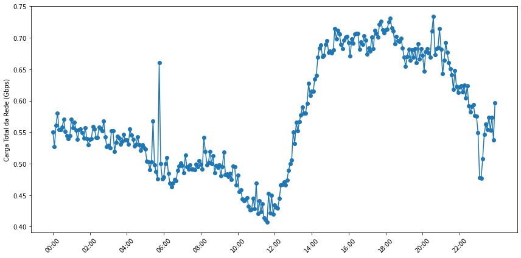
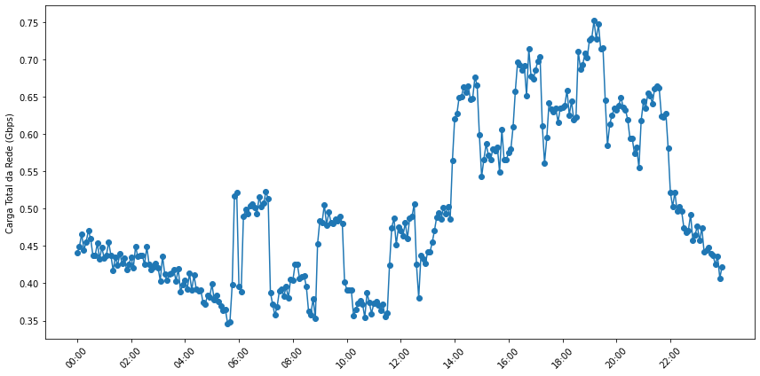
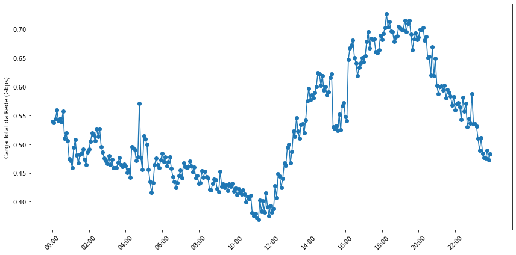

# AttEdgeAwareGNN: Previsão de Carga em Redes Backbone com GNN Sensível a Arestas

## Nova versão

Uma versão mais atual dessa ferramenta pode ser encontrada [aqui](https://github.com/wagneraljr/EdgeAwareGNN/tree/new_model).

## Visão Geral
O projeto EdgeAwareGNN introduz um modelo inovador de Rede Neural Gráfica (GNN) sensível a arestas aplicado à a previsão de carga em redes backbone. Este projeto visa explorar atributos de arestas como forma de enriquecer as representações de nós geradas por GNNs. Através da comparação com arquiteturas tradicionais de GNNs, o AttEdgeAwareGNN demonstra melhorias significativas na precisão das previsões.

## Arquitetura dos Modelos
O projeto implementa múltiplas arquiteturas de GNN, incluindo os tradicionais GCN e GraphSAGE e o nosso modelo `AttEdgeAwareGCN`, que incorpora mecanismos de atenção às arestas. O arquivo `models.py` descreve esses modelos detalhadamente:

- **GCN**: Modelo inspirado nas redes neurais convolucionais aplicadas especificamente a grafos.
- **GraphSAGE**: Um modelo robusto que utiliza convoluções de grafos para agregação de informações de vizinhança.
- **AttEdgeAwareGNN**: Um avanço sobre o GCN tradicional, este modelo integra informações de aresta de forma eficaz, permitindo uma previsão de carga mais precisa.

## Preparação dos Dados
Os modelos são treinados usando dados históricos de tráfego em uma rede backbone, especificamente a rede Abilene, representada pelo arquivo `Abilene.gml`. Criada em 1999 e encerrada em 2007, a rede Abilene era composta por 11 nós e 14 links. O conjunto de dados usado neste trabalho contém seis meses de dados de tráfego entre os nós da rede Abilene, medidos a cada cinco minutos. Os dados são dispostos em matrizes de tráfego NxN, onde N é o número de nós da rede. Uma vez que o objetivo deste trabalho é estimar a carga nos nós, o tráfego de entrada e saída de cada nó na matriz de tráfego foi somado e normalizado. A estrutura da rede contém arestas com oito atributos cada, representados por valores reais. Além disso, o modelo foi enriquecido com o cálculo de atributos implícitos das arestas: centralidade de intermediação, grau das arestas e coeficiente de agrupamento das arestas. 
Os arquivos de medições de tráfego podem ser baixados do seguinte [link](https://drive.google.com/drive/folders/1pi9vbm8zQUiEFZu8P2irCPTp1__uY80B?usp=drive_link).

<html>

  

    
  

  

    
  

  

    
  

</html>

## Otimização de Hiperparâmetros
A otimização de hiperparâmetros é realizada pelos scripts `hyper_day.py` e `hyper_week.py`, que ajustam os modelos usando dados de um dia e uma semana, respectivamente. Esses scripts empregam a biblioteca `optuna` para encontrar a configuração ideal de hiperparâmetros que maximiza a precisão das previsões. Este processo é crucial para garantir que os modelos estejam bem ajustados às características específicas dos dados de tráfego. Por simplicidade, foram usados dois arquivos diferentes para testar dados históricos em dois cenários: o tráfego de um dia antes e de uma semana antes da data alvo da previsão de carga.

## Avaliação e Teste
Após a otimização, os scripts `test_day.py` e `test_week.py` avaliam o desempenho dos modelos. Estes scripts carregam os hiperparâmetros otimizados e usam novos conjuntos de dados para prever as cargas, comparando as previsões com valores reais. As métricas de avaliação incluem:

- **Erro Médio Absoluto (MAE)**
- **Erro Quadrático Médio (MSE)**
- **Coeficiente de Determinação (R²)**

Estas métricas ajudam a quantificar o quão próximo as previsões estão dos valores reais, proporcionando uma medida clara da eficácia do modelo. Também por simplicidade, os arquivos de testes foram replicados para cada cenário.

## Visualização dos Resultados
Os resultados das previsões são visualizados utilizando `matplotlib`, gerando gráficos que comparam as cargas previstas com as reais. Esta visualização facilita a identificação de discrepâncias e destaca a precisão das previsões do modelo. Exemplos de tais gráficos podem ser gerados pelos scripts de teste e são fundamentais para a análise de desempenho.

## Personalização da Ferramenta
### Treine, Avalie e Compare o seu Próprio Modelo

Nossa ferramenta permite a inclusão de modelos de GNNs personalizados para treinamento e teste na rede abilene seguindo estes passos:
1. Inclua o código do seu modelo no arquivo `models.py`.
2. Otimize os hiperparâmetros do seu modelo importando-o nos *scripts* `hyper_day.py` e/ou `hyper_week.py` e criando novas funções objetivo. As funções presentes nestes arquivos podem ser usadas como base, atentando-se apenas à inicialização e loop de treino do modelo especificado.
3. Inicialize, configure os hiperparâmetros do seu modelo e crie o loop de treinamento conforme os exemplos nos arquivos `test_day.py` e/ou `test_week.py`.

### Mudança na Matriz de Tráfego
O uso de diferentes matrizes de tráfego também é possível:

* Para diferentes períodos de tempo do conjunto de dados do Abilene, basta substituir os arquivos `.dat` pelos arquivos do período desejado.
* Para matrizes de tráfego de outras fontes, é preciso alterar as funções em `src/utils/data_utils.py` para ler e tratar os dados da matriz de acordo com a necessidade.

## Conclusão
O EdgeAwareGNN representa um passo significativo na previsão de carga em redes backbone, demonstrando o potencial dos modelos GNN sensíveis a arestas. Encorajamos a comunidade a explorar, estender e aplicar este trabalho em outros contextos de redes complexas, contribuindo para o avanço das técnicas de previsão baseadas em GNN.
